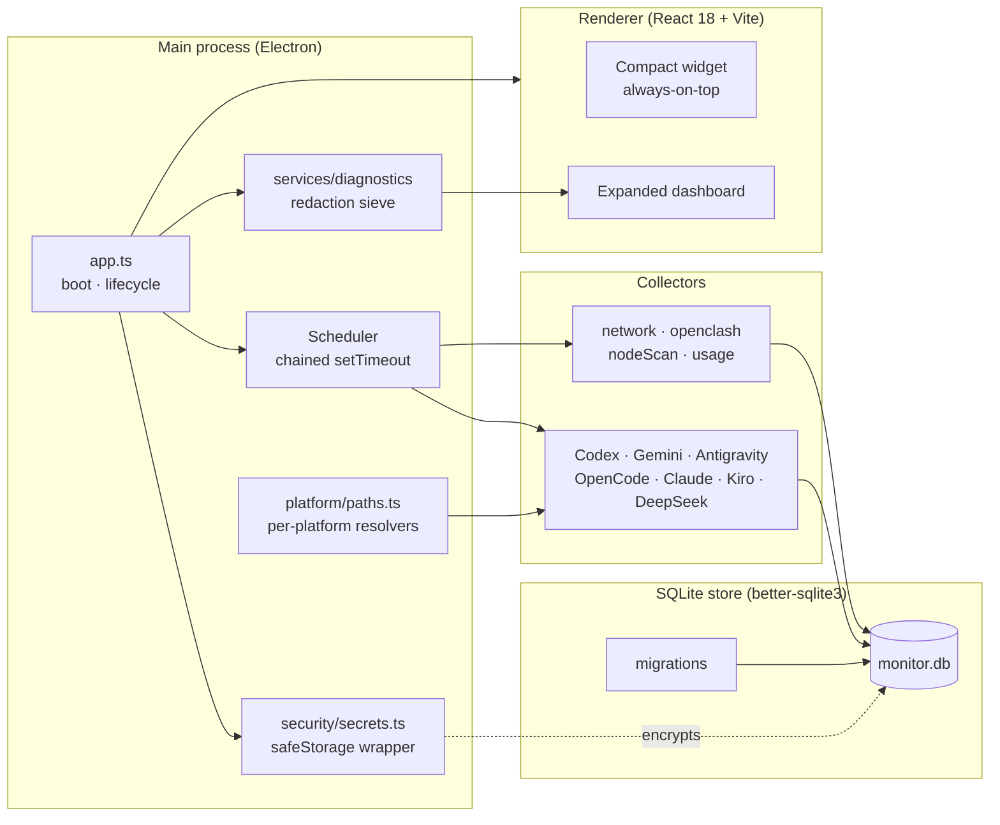

<div align="center">


# Monitor

**A floating-widget desktop monitor for OpenClash connectivity and AI usage.**

<sub>Cross-platform · Electron 33 · Better-SQLite3 · React 18 · Property-tested</sub>

[Features](#features) · [Screenshots](#screenshots) · [Supported Platforms](#supported-platforms) · [Installation](#installation) · [Development](#development) · [Packaging](#packaging) · [Architecture](#architecture)

[中文 README](README.zh-CN.md)

</div>

---

## Features

| | |
|---|---|
| 🌐 **OpenClash live status** | Continuous probe of the controller, current node, latency sparklines, and node-group health. Hide-instead-of-quit tray, Spaces-aware floating widget on macOS. |
| 🧠 **AI usage aggregation** | Per-account quota and token counters for Codex, Gemini CLI, Antigravity, OpenCode, DeepSeek, Claude Code, and Kiro IDE — credentials encrypted at rest via Keychain (macOS) / DPAPI (Windows). |
| 🪟 **Always-on-top widget** | Transparent, frameless, draggable. On macOS the widget floats above full-screen Spaces (`screen-saver` level) and `LSUIElement = true` keeps it out of the Dock and Cmd+Tab. |
| 📊 **Expanded dashboard** | Connectivity history, AI quota, per-collector capability, and a redacted diagnostics export bundle for support tickets. |
| 🔐 **Secrets stay local** | All secret values flow through `safeStorage`. The diagnostics export is value-redacted and runs through a property-based "no-leak" sieve covering 100+ generated cases per platform. |
| 🧪 **Spec-driven, property-tested** | 514 tests pass on every commit, including ~13 fast-check property suites that exercise per-platform path resolution, atomic build artefacts, and lifecycle invariants. |

## Screenshots

### Window modes

<p align="center">
  
  &nbsp;&nbsp;
  
  &nbsp;&nbsp;
  
</p>

<p align="center">
  <sub><b>Mini</b> · status rail at screen edge</sub> &nbsp;·&nbsp;
  <sub><b>Compact</b> · node + AI quota glance</sub> &nbsp;·&nbsp;
  <sub><b>Expanded</b> · full dashboard</sub>
</p>

### Network panel

<p align="center">
  
</p>

<p align="center"><sub>OpenClash live status, node-group health, latency sparklines, quick actions, full node table</sub></p>

### Monthly AI usage

<p align="center">
  
</p>

<p align="center"><sub>Per-account AI quota strip and token breakdown across providers</sub></p>

### Theming

<p align="center">
  
  &nbsp;&nbsp;
  
</p>

<p align="center">
  <sub>11 built-in compact-widget themes spanning two design languages</sub>
</p>

## Supported Platforms

| OS | Architectures | Minimum version | Distribution |
|---|---|---|---|
| 🍎 **macOS 11+** (Big Sur) | `arm64` (Apple Silicon) · `x64` (Intel) | 11.0 | Two arch-specific dmgs |
| 🪟 **Windows 10+** | `x64` | 10.0.19041 | NSIS installer (`Monitor Setup <version>.exe`) |
| 🐧 Linux | `x64` | — | Development-time only, not a release target |

The macOS build uses Hardened Runtime entitlements (`com.apple.security.cs.allow-jit` + `allow-unsigned-executable-memory`) so a future opt-in to Developer ID signing requires no entitlements change.

## Installation

### Windows

1. Download the latest `Monitor Setup <version>.exe` from `release/`.
2. Run the installer. SmartScreen may prompt a one-time confirmation because the binary is unsigned.
3. The widget launches into the system tray; right-click for the menu.

### macOS

1. Download the dmg matching your CPU:
   - Apple Silicon (M1 · M2 · M3 · M4): `Monitor-<version>-arm64.dmg`
   - Intel: `Monitor-<version>-x64.dmg`
2. Open the dmg and drag `Monitor.app` into `/Applications`.
3. Follow the [Gatekeeper bypass](#macos-installation) below on first launch.

## macOS Installation

The macOS distribution is **unsigned** — it ships without an Apple Developer ID signature and without notarization. Gatekeeper will refuse to launch the app on first run with a "无法打开" / "cannot be opened" dialog. Bypass this once with the following gesture:

> 首次运行：右键（Ctrl+click）.app → 打开 → 在弹出的 Gatekeeper 对话框中确认打开

After the first successful launch macOS remembers the user-confirmed exception and subsequent launches behave like any signed app. Replacing `Monitor.app` in `/Applications` during an update may require repeating the gesture once.

If you would prefer a signed build, the `electron-builder.yml#mac.identity` field is wired to accept a Developer ID and the entitlements file is already in place — see `.kiro/specs/macos-platform-support/design.md` for the future opt-in path.

### macOS posture at a glance

| Behaviour | Source | Why |
|---|---|---|
| `LSUIElement = true` | `electron-builder.yml#mac.extendInfo` | No Dock icon, no Cmd+Tab entry — reads as a menu-bar accessory |
| `setAlwaysOnTop(true, 'screen-saver')` | `src/main/windows.ts` | Floats above full-screen apps |
| `setVisibleOnAllWorkspaces(true, { visibleOnFullScreen: true })` | `src/main/windows.ts` | Stays visible across Spaces |
| Template tray icon | `build/tray-iconTemplate.png` (24×24) + `@2x.png` (48×48) | Recolours with menu-bar tint via `setTemplateImage(true)` |
| Login Items registration | `app.setLoginItemSettings({ openAtLogin })` | Cross-platform autostart, no `process.platform` branching |

## Development

```bash
npm install
npm run dev          # Electron main + Vite renderer in watch mode
npm run typecheck    # tsc --noEmit for both main and renderer projects
npm test             # vitest run — 514 tests, ~10s
npm run icons        # regenerate build/icon.{svg,ico,icns,png} + tray assets
```

The repo follows a **spec-driven** workflow under `.kiro/specs/`. Each feature directory contains `requirements.md`, `design.md`, and `tasks.md`; property-based tests live alongside their implementation as `*.pbt.test.ts` files.

## Packaging

```bash
# Windows host
npm run package      # → release/Monitor Setup <version>.exe

# macOS host
npm run package:mac  # → release/Monitor-<version>-arm64.dmg
                     # → release/Monitor-<version>-x64.dmg
```

`npm run package:mac` runs the `prepackage:mac` probe first — it verifies Xcode Command Line Tools (`xcode-select -p`) and Python 3.x are installed, and unlinks any stale `better_sqlite3.node` whose Mach-O / PE-COFF magic bytes do not match the current target. Both steps must exit 0 before `electron-builder --mac --x64 --arm64` runs, so a missing prerequisite never produces a broken dmg.

### Heavy integration tests

Two opt-in integration tests exercise the real build:

```bash
# Windows
RUN_PACKAGING_INTEGRATION=1 npx vitest run tests/integration/package-win.integration.test.ts

# macOS
RUN_PACKAGING_INTEGRATION=1 npx vitest run tests/integration/package-mac.integration.test.ts
```

They are skipped under a normal `npm test` so the suite stays fast.

## Architecture



### Tech stack

- **Electron 33** with Hardened Runtime entitlements
- **React 18 + Vite 5** for the renderer; `contextIsolation: true`, `sandbox: true`, hardened CSP
- **better-sqlite3 11** for the local store with versioned migrations
- **Zod** for IPC and settings schemas; the strict schemas back the renderer↔main contract
- **fast-check 3** for property-based testing
- **electron-builder 25** with two arch-specific dmgs and a single NSIS installer

## Spec workflow

Every feature in this repo lands as a spec triple under `.kiro/specs/<feature-name>/`:

```
.kiro/specs/
├── codebase-refactor-and-ui-uplift/
├── compact-theme-system/
├── cpa-quota-import/
├── desktop-monitor-widget/
├── macos-platform-support/        ← this feature's home
│   ├── requirements.md            # EARS-formatted acceptance criteria
│   ├── design.md                  # implementation plan + correctness properties
│   └── tasks.md                   # 71 actionable tasks, dependency-graphed
└── network-quick-actions/
```

The `macos-platform-support` spec landed in 10 waves spanning resolver modules, collector refactors, runtime posture, build artefacts, configuration, documentation, and integration tests. All 71 tasks are checked off and 13 property-based tests pin the per-platform invariants.

## License

Personal-use software; not currently distributed under an open-source license.
