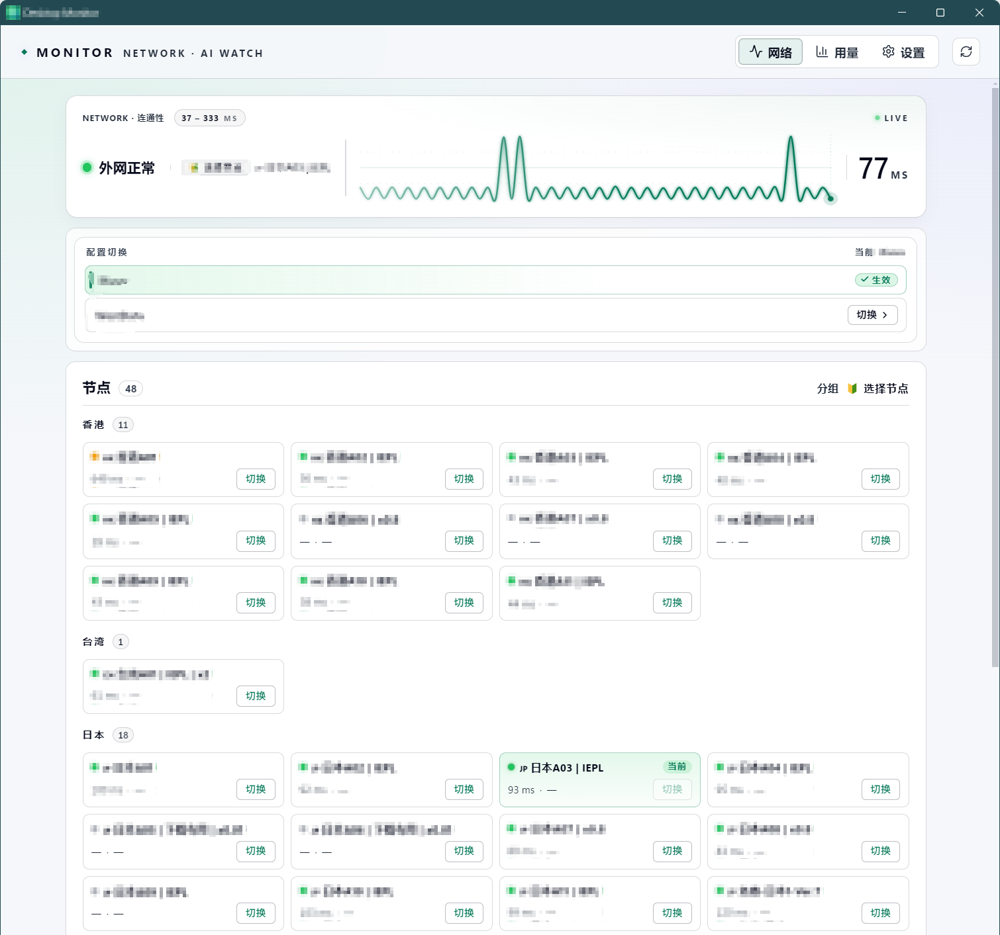
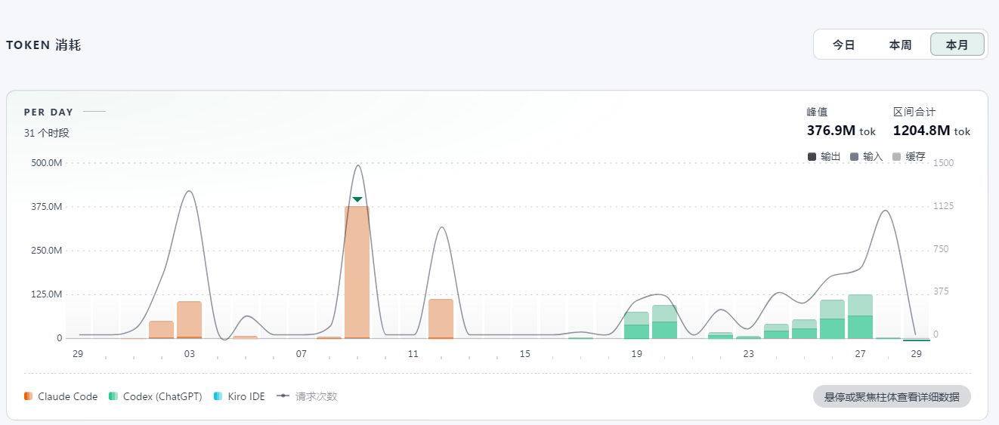
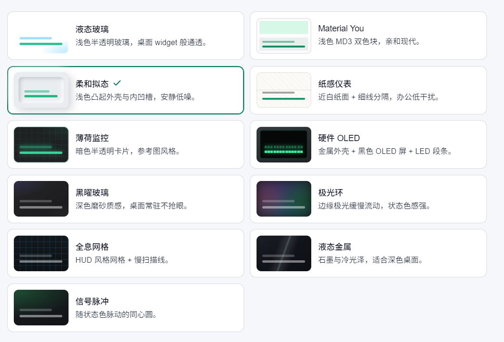
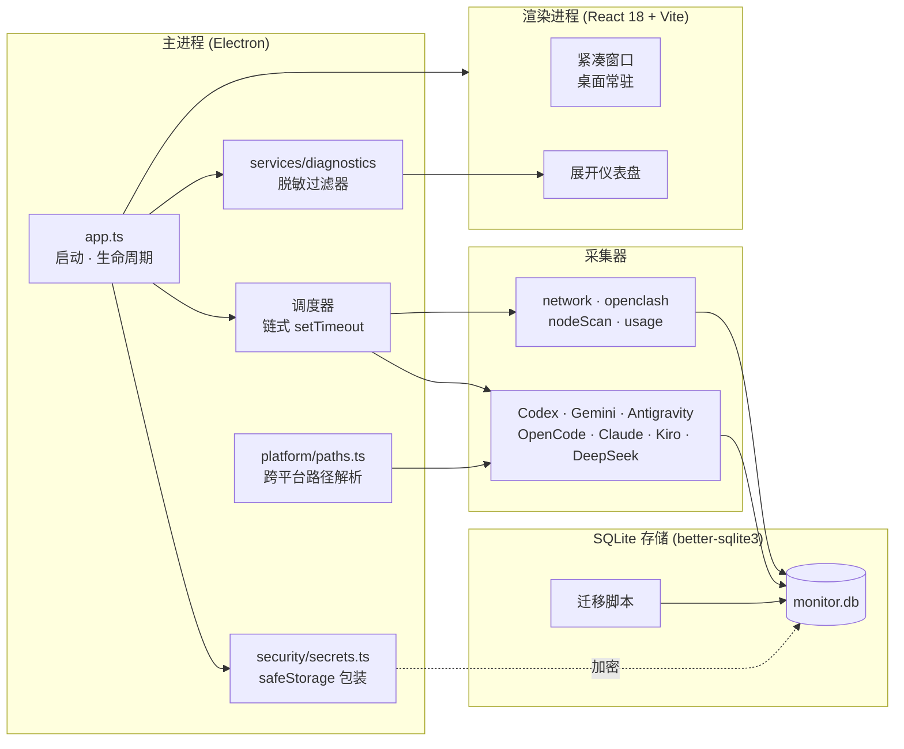

<div align="center">


# Monitor

**桌面悬浮小组件，实时监控 OpenClash 连通性与 AI 用量。**

<sub>跨平台 · Electron 33 · Better-SQLite3 · React 18 · 属性测试覆盖</sub>

[功能](#功能) · [截图](#截图) · [安装](#安装) · [使用指南](#使用指南) · [开发](#开发) · [打包](#打包) · [架构](#架构)

[English README](README.md)

</div>

---

## 功能

| | |
|---|---|
| 🌐 **OpenClash 实时状态** | 持续探测控制器、当前节点、延迟曲线、节点组健康度。托盘"关闭即隐藏"，macOS 上悬浮窗跨 Spaces 工作。 |
| 🧠 **AI 用量聚合** | 按账号统计 Codex (ChatGPT)、Gemini CLI、Antigravity、Claude Code、Kiro IDE、OpenCode Go、DeepSeek、小米 Mimo、OpenAI 兼容服务、Gemini API 的 quota 与 token 用量；密钥通过 Keychain (macOS) / DPAPI (Windows) 加密落盘。 |
| 🪟 **悬浮置顶窗口** | 透明无边框、可拖拽。macOS 下使用 `screen-saver` 层级跨全屏 Spaces 显示，配合 `LSUIElement = true` 隐藏 Dock 图标与 Cmd+Tab 项。 |
| 🎨 **11 种紧凑主题** | 液态玻璃、Material You、柔和拟态、纸感仪表、薄荷监控、硬件 OLED、黑曜玻璃、极光环、全息网格、液态金属、信号脉冲；深浅模式独立切换。 |
| 📊 **展开式仪表盘** | 网络快捷动作（节点切换 + 配置切换）、连通性历史、AI 月度用量、节点扫描列表、设置面板。 |
| 🔐 **密钥本地保存** | 所有敏感值通过 `safeStorage` 加密；诊断导出走属性测试覆盖的脱敏过滤器，每平台 100+ 随机用例验证不泄漏。 |
| 🧪 **规范驱动 + 属性测试** | 每次提交跑 514 项测试（约 10s），其中 ~13 个 fast-check 属性测试覆盖跨平台路径解析、构建产物原子性与生命周期不变量。 |

## 截图

### 三种窗口模式

<table>
  <tr>
    <td align="center" width="33%">
      
      <sub><b>迷你</b> — 极小状态条，贴屏边显示</sub>
    </td>
    <td align="center" width="33%">
      
      <sub><b>紧凑</b> — 节点 + AI 配额一览，桌面常驻</sub>
    </td>
    <td align="center" width="33%">
      
      <sub><b>展开</b> — 完整仪表盘，含历史与诊断</sub>
    </td>
  </tr>
</table>

### 仪表盘视图

<table>
  <tr>
    <td align="center" width="50%">
      
      <sub><b>网络</b> — OpenClash 实时状态、节点组健康度、延迟曲线</sub>
    </td>
    <td align="center" width="50%">
      
      <sub><b>月度用量</b> — 按账号汇总的 AI 配额与 token 趋势</sub>
    </td>
  </tr>
</table>

### 主题

<table>
  <tr>
    <td align="center" width="50%">
      
      <sub><b>主题</b> — 紧凑窗口的内置配色预设</sub>
    </td>
    <td align="center" width="50%">
      
      <sub><b>更多主题</b> — 扩展主题画廊</sub>
    </td>
  </tr>
</table>

## 支持平台

| 系统 | 架构 | 最低版本 | 分发形式 |
|---|---|---|---|
| 🍎 **macOS 11+** (Big Sur) | `arm64` (Apple Silicon) · `x64` (Intel) | 11.0 | 两个架构独立 dmg |
| 🪟 **Windows 10+** | `x64` | 10.0.19041 | NSIS 安装包 (`Monitor Setup <version>.exe`) |
| 🐧 Linux | `x64` | — | 仅开发用，不作为发布目标 |

macOS 构建启用了 Hardened Runtime 权限（`com.apple.security.cs.allow-jit` + `allow-unsigned-executable-memory`），未来若开启 Developer ID 签名无需改动 entitlements。

## 安装

### Windows

1. 从 `release/` 下载最新的 `Monitor Setup <version>.exe`。
2. 运行安装包。由于二进制未签名，SmartScreen 会提示一次确认。
3. 启动后小组件直接进入系统托盘，右键查看菜单。

### macOS

1. 按 CPU 选择对应 dmg：
   - Apple Silicon (M1 · M2 · M3 · M4)：`Monitor-<version>-arm64.dmg`
   - Intel：`Monitor-<version>-x64.dmg`
2. 打开 dmg，把 `Monitor.app` 拖入 `/Applications`。
3. 首次启动需绕过 Gatekeeper（见下方说明）。

### macOS 首次启动绕过 Gatekeeper

macOS 分发包**未签名**——没有 Developer ID 签名也未做公证。Gatekeeper 在首次启动时会拒绝，并弹出"无法打开"对话框。只需做一次以下操作：

> 首次运行：右键（Ctrl+click）`Monitor.app` → 打开 → 在弹出的 Gatekeeper 对话框中确认打开

之后系统会记住这个用户确认的例外，后续启动与已签名应用无异。更新替换 `/Applications/Monitor.app` 后可能需要再做一次。

如果需要签名版本，`electron-builder.yml#mac.identity` 字段已预留 Developer ID 接入位，entitlements 文件也已就绪——详情参考 `.kiro/specs/macos-platform-support/design.md`。

## 使用指南

### 三种窗口模式

应用启动后默认进入**紧凑**模式悬浮窗。点击窗口右上角的尺寸切换按钮可在三种模式间循环：

| 模式 | 适用场景 | 内容 |
|---|---|---|
| **迷你** | 长期挂屏，最低视觉干扰 | 状态色 + 当前延迟数字 |
| **紧凑** | 桌面常驻，状态一目了然 | 网络状态行 + 当前节点 + AI 配额条 |
| **展开** | 全功能仪表盘 | 三个 Tab：网络 / 用量 / 设置 |

迷你与紧凑模式都可拖拽，窗口位置自动持久化。

### 系统托盘

- **左键单击托盘图标**：显示/隐藏悬浮窗
- **右键托盘图标**：菜单含"显示窗口、打开仪表盘、立即刷新、退出"
- **关闭悬浮窗按钮**：仅隐藏到托盘，不退出进程；要彻底退出请使用托盘菜单

macOS 上托盘图标使用模板图（`tray-iconTemplate.png` 24×24 + `@2x.png` 48×48），会随菜单栏色调自动着色。

### 三个主标签页

展开窗口顶部 Tab 栏：

#### 1. 网络（默认）

- **状态卡片**：连通性指示灯 + 当前节点平均延迟 + 实时脉冲
- **快捷动作面板**：
  - **快速切节点**：按延迟排序的候选节点，一键切换；切换失败会展示标准化错误码
  - **快速切配置**：按白名单展示可切换的 OpenClash 配置文件，切换前弹窗二次确认
- **节点列表**：完整节点扫描结果，支持组筛选、按延迟/丢包/状态排序

切换前后的状态变化会实时反映在卡片上，最近一次切换的失败原因（如有）会显示在快捷动作面板下方。

#### 2. 用量

- **配额条**：按账号汇总剩余 quota（仅 `official` 能力的账号显示百分比）
- **token 柱状图**：当月按 provider 拆分的 token 用量
- **账号列表**：刷新状态、最近错误、能力类型（`官方 Quota` / `可用性检查` / `仅活动` 等）

#### 3. 设置

侧边导航分九个分组：

| 分组 | 配置内容 |
|---|---|
| 🎨 **外观** | 深浅色、紧凑窗口主题、字体缩放、紧凑窗口缩放 |
| 🖥 **控制器** | OpenClash 主控 URL 与密钥 |
| 🛰 **探测目标** | 外网连通性 URL 列表 |
| 📑 **主分组** | 展示与切换的 OpenClash 节点组 |
| 📡 **路由器** | 内网健康检测端口 |
| ⏱ **刷新节奏** | 网络 / OpenClash / 当前节点 / 节点扫描 / AI 用量 / 清理的采样间隔 (ms) |
| 🔁 **切换** | 节点切换确认延迟 |
| 🔌 **管理接口** | OpenClash LuCI 地址、超时、白名单配置文件 |
| ✨ **AI 账号** | 添加 / 启用 / 刷新 / 删除 AI 凭据 |

### 添加 AI 账号

「AI 账号」分组支持两种凭据形式：

- **认证文件导入**：适用于 Codex (ChatGPT)、Gemini CLI、Antigravity、Claude Code、Kiro IDE、OpenCode Go——选择 CLI 工具生成的 `auth.json` / `credentials.json`，应用会原文加密入库
- **手动 API Key**：适用于 DeepSeek、小米 Mimo、Gemini API、OpenAI 兼容服务——填入 base URL 与 API key

凭据加密策略：

- macOS：通过 Electron `safeStorage`，底层走 Keychain
- Windows：通过 Electron `safeStorage`，底层走 DPAPI

数据库中只保存密文与必要元数据，明文永不落盘。

### 切换 OpenClash 配置文件

在「设置 → 管理接口」勾选可切换的 `.yaml` 配置文件加入白名单，之后在「网络 → 快速切配置」即可一键切换：

1. 应用通过 LuCI API 写入新配置并触发 reload
2. 切换窗口期内持续验证 OpenClash 是否恢复正常
3. 验证失败会保留旧状态并展示错误码

历史切换记录写入本地 SQLite，可在诊断导出中查看。

### 主题切换

「设置 → 外观」提供 11 种紧凑窗口主题，分两代设计语言：

**v2 现代设计**

- 液态玻璃 — 浅色半透明玻璃，桌面 widget 般通透
- Material You — 浅色 MD3 双色块，亲和现代
- 柔和拟态 — 浅色凸起外壳与内凹槽，安静低噪
- 纸感仪表 — 近白纸面 + 细线分隔，办公低干扰
- 薄荷监控 — 暗色半透明卡片，参考图风格（默认）
- 硬件 OLED — 金属外壳 + 黑色 OLED 屏 + LED 段条

**v1 经典预设**

- 黑曜玻璃 — 深色磨砂质感
- 极光环 — 边缘极光缓慢流动
- 全息网格 — HUD 风格网格 + 慢扫描线
- 液态金属 — 石墨与冷光泽
- 信号脉冲 — 随状态色脉动的同心圆

### 开机自启

「设置 → 切换」内含开机自启开关，跨平台统一通过 `app.setLoginItemSettings({ openAtLogin })` 处理，不分支 `process.platform`。

### 立即刷新

展开窗口顶部刷新按钮、托盘菜单和快捷键都可触发"立即刷新"，会强制跳过当前调度间隔，立刻发起一轮全量采集。

### 诊断导出

设置或托盘菜单可导出诊断 zip，包含日志、配置（脱敏后）、最近一次采集结果。脱敏过滤器跑过 100+ 随机用例的属性测试，确保密钥与 Cookie 不会泄漏。提交支持工单时附上即可。

## macOS 运行时姿态

| 行为 | 来源 | 原因 |
|---|---|---|
| `LSUIElement = true` | `electron-builder.yml#mac.extendInfo` | 不在 Dock 与 Cmd+Tab 列表中显示，更像菜单栏附件 |
| `setAlwaysOnTop(true, 'screen-saver')` | `src/main/windows.ts` | 浮在全屏应用之上 |
| `setVisibleOnAllWorkspaces(true, { visibleOnFullScreen: true })` | `src/main/windows.ts` | 跨 Spaces 始终可见 |
| 模板托盘图 | `build/tray-iconTemplate.png` (24×24) + `@2x.png` (48×48) | 通过 `setTemplateImage(true)` 跟随菜单栏色调 |
| 登录项注册 | `app.setLoginItemSettings({ openAtLogin })` | 跨平台开机自启，零 `process.platform` 分支 |

## 开发

```bash
npm install
npm run dev          # Electron 主进程 + Vite 渲染进程，watch 模式
npm run typecheck    # tsc --noEmit，主进程与渲染进程分别校验
npm test             # vitest run，514 项测试，约 10 秒
npm run icons        # 重新生成 build/icon.{svg,ico,icns,png} 与托盘资源
```

仓库采用**规范驱动**工作流，所有特性都落在 `.kiro/specs/<feature-name>/` 下，含 `requirements.md`、`design.md`、`tasks.md` 三联文件；属性测试与实现并列存放，命名为 `*.pbt.test.ts`。

## 打包

```bash
# Windows 主机
npm run package      # → release/Monitor Setup <version>.exe

# macOS 主机
npm run package:mac  # → release/Monitor-<version>-arm64.dmg
                     # → release/Monitor-<version>-x64.dmg
```

`npm run package:mac` 会先跑 `prepackage:mac` 探针：检查 Xcode Command Line Tools (`xcode-select -p`) 与 Python 3.x 是否安装，并清理 Mach-O / PE-COFF 头与目标架构不匹配的过期 `better_sqlite3.node`。两步都成功后才会调用 `electron-builder --mac --x64 --arm64`，避免缺前置依赖时产出半截 dmg。

### 重型集成测试

两个 opt-in 集成测试覆盖真实打包流程：

```bash
# Windows
RUN_PACKAGING_INTEGRATION=1 npx vitest run tests/integration/package-win.integration.test.ts

# macOS
RUN_PACKAGING_INTEGRATION=1 npx vitest run tests/integration/package-mac.integration.test.ts
```

普通 `npm test` 不会跑它们，保持测试套件快速。

## 架构



### 技术栈

- **Electron 33**，启用 Hardened Runtime 权限
- **React 18 + Vite 5** 渲染层；`contextIsolation: true`、`sandbox: true`、严格 CSP
- **better-sqlite3 11** 本地存储 + 版本化迁移
- **Zod** 校验 IPC 与设置 schema，作为渲染↔主进程契约
- **fast-check 3** 驱动属性测试
- **electron-builder 25** 输出双架构 dmg 与单 NSIS 安装包

## 规范工作流

仓库每个特性都对应 `.kiro/specs/<feature-name>/` 下的规范三联：

```
.kiro/specs/
├── codebase-refactor-and-ui-uplift/
├── compact-theme-system/
├── cpa-quota-import/
├── desktop-monitor-widget/
├── macos-platform-support/        ← macOS 支持落点
│   ├── requirements.md            # EARS 格式验收标准
│   ├── design.md                  # 实现方案 + 正确性属性
│   └── tasks.md                   # 71 个可执行任务，含依赖图
└── network-quick-actions/
```

`macos-platform-support` 规范分 10 个 wave 落地，覆盖路径解析模块、采集器重构、运行时姿态、构建产物、配置、文档与集成测试。71 项任务全部完成，13 个属性测试钉住跨平台不变量。

## 许可

个人使用软件，目前未以开源许可证分发。
